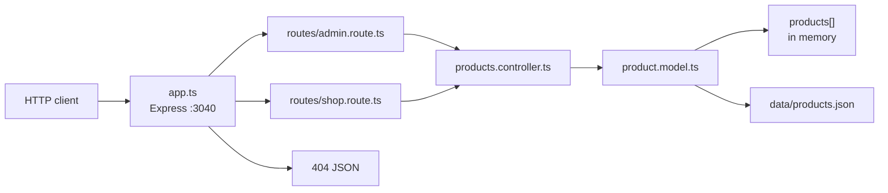

# backend-concepts

Express and TypeScript backend learning project. Products are stored in a JSON file and served through admin (full catalog) and shop (published only) routes.

- [Changelog](CHANGELOG.md) — shipped API and product changes
- [Learning log](LEARNING.md) — backend concepts practiced here
- [Backend reference](BACKEND-REFERENCE.md) — durable mentor notes (naming, layers, drafts) for later projects

## Setup

Requires [Yarn 4](https://yarnpkg.com/) (this repo uses Yarn 4.12).

```bash
yarn install
yarn start
```

The server listens on [http://localhost:3040](http://localhost:3040).

| Script | What it does |
| --- | --- |
| `yarn start` | Run `app.ts` with `tsx` and reload on `.ts` / `.json` changes |
| `yarn build` | Compile TypeScript to `dist/` |

## API

JSON request bodies are accepted. Unknown routes return `404` with `{ "message": "API not found" }`.

### Admin

| Method | Path | Description |
| --- | --- | --- |
| `POST` | `/admin/add-product` | Create a product |
| `GET` | `/admin/products` | List all products |
| `GET` | `/admin/product/:id` | Get a product by id |

Create body:

```json
{
  "title": "A book",
  "price": 19.99,
  "description": "A useful book",
  "imageUrl": "https://example.com/book.png",
  "isPublished": true
}
```

### Shop

Shop routes return only products with `isPublished: true`.

| Method | Path | Description |
| --- | --- | --- |
| `GET` | `/shop/products` | List published products |
| `GET` | `/shop/product/:id` | Get a published product by id |

## Layout

```
app.ts                      # Express app, middleware, 404 handler
routes/admin.route.ts       # Admin product routes
routes/shop.route.ts        # Shop product routes
controllers/                # HTTP handlers (status codes + JSON)
models/                     # Product domain + persistence
types/                      # Shared ProductInput / ProductRecord types
utils/                      # JSON file path + load helper
data/products.json          # File-backed product store
```



A request hits `app.ts`, which parses the body and mounts `/admin` or `/shop`. Both routers call the same controller. The `Product` class keeps the catalog in memory (loaded from JSON on startup) and writes the file on create. Shop handlers filter with `isPublished`; admin handlers return the full catalog.
