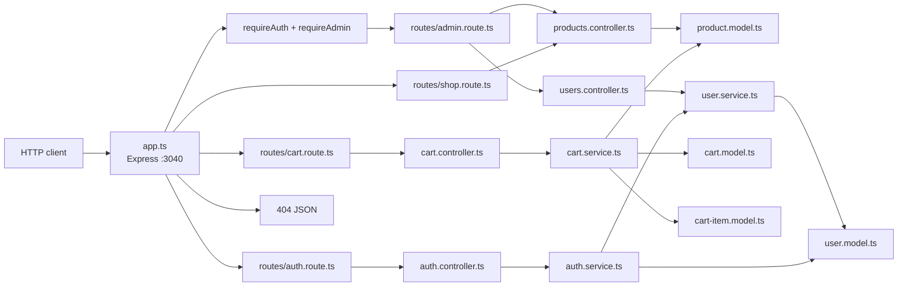

# backend-concepts

Express and TypeScript backend learning project. Products, users, and the cart live in MySQL (admin = full catalog, shop = published only). Each guest (cookie) or logged-in user has their own cart (`carts`) plus items (`cart_items`). Users sign up and log in for a JWT; `/admin` needs an admin token.

- [Changelog](CHANGELOG.md) — shipped API and product changes
- [Learning log](docs/LEARNING.md) — backend concepts practiced here
- [Backend reference](docs/BACKEND-REFERENCE.md) — durable mentor notes (naming, layers, drafts) for later projects
- [Auth plan](docs/AUTH-PLAN.md) — signup/login, JWT, roles (done); guest cart cookie and cart per user (done)
- [Postman collection](postman/backend-concepts.postman_collection.json) — import into Postman (`baseUrl` = `http://localhost:3040`). When the API changes, update this file and sync it to Postman (MCP).
- [Postman notes](docs/POSTMAN.md) — body types, environments, Share value vs Invite, Scripts → After response
- [Mentor briefing](docs/MENTOR-BRIEFING.md) — cart chapter snapshot

## Setup

Requires [Yarn 4](https://yarnpkg.com/) (this repo uses Yarn 4.12).

```bash
yarn install
cp .env.example .env   # fill in DB_* and JWT_SECRET
yarn start
```

The server listens on [http://localhost:3040](http://localhost:3040). It refuses to start if `JWT_SECRET` is missing or shorter than 32 characters, or `JWT_EXPIRES_IN` is missing or invalid.

| Script | What it does |
| --- | --- |
| `yarn start` | Run `app.ts` with `tsx` and reload on `.ts` / `.json` changes. Sets `NODE_ENV=development`, which turns on SQL query logs (without it, only errors are logged) |
| `yarn build` | Compile TypeScript to `dist/` |

Schema is manual SQL (`synchronize: false`). The first admin is created by hand:

```sql
UPDATE users SET role = 'admin' WHERE email = 'you@example.com';
```

## API

JSON request bodies are accepted. Unknown routes return `404` with `{ "message": "API not found" }`.

### Auth

| Method | Path | Description |
| --- | --- | --- |
| `POST` | `/auth/signup` | Create a `customer` account (`201`; `409` if the email exists) |
| `POST` | `/auth/login` | Returns `{ data: { accessToken } }` (`401` "Invalid email or password") |
| `GET` | `/auth/me` | The caller's own user (needs `Authorization: Bearer <token>`) |

Signup body (`role` is ignored here — signup is always `customer`):

```json
{
  "email": "you@example.com",
  "password": "secret123",
  "firstName": "Mohamed",
  "lastName": "Magdy"
}
```

Login body:

```json
{
  "email": "you@example.com",
  "password": "secret123"
}
```

The access token is a JWT (`{ userId, email, role }`, HS256, `JWT_EXPIRES_IN` seconds — 15 minutes by default). Send it as `Authorization: Bearer <token>`. `401` = missing, malformed, invalid, or expired token. User responses never include `password`.

### Admin

Everything under `/admin` needs an **admin** token: `401` without a valid token, `403` `"Admins only"` for a customer.

| Method | Path | Description |
| --- | --- | --- |
| `POST` | `/admin/add-product` | Create a product |
| `PUT` | `/admin/products/:id` | Replace an existing product (id in the URL; full body) |
| `DELETE` | `/admin/delete-product/:id` | Delete a product (id in the URL, no body) |
| `GET` | `/admin/products` | List all products |
| `GET` | `/admin/products/:id` | Get a product by id |
| `POST` | `/admin/add-user` | Create a user (optional `role`) |
| `PUT` | `/admin/update-user/:id` | Replace a user (full body; does not change `role`) |
| `DELETE` | `/admin/delete-user/:id` | Delete a user (id in the URL, no body) |
| `GET` | `/admin/users` | List users |
| `GET` | `/admin/users/:id` | Get a user by id |

Product create body:

```json
{
  "title": "A book",
  "price": 19.99,
  "description": "A useful book",
  "imageUrl": "https://example.com/book.png",
  "isPublished": true
}
```

MySQL assigns the `id` (`AUTO_INCREMENT` / `insertId`). Product update takes the same fields as create; the `id` is in the URL.

User create body (`role` is optional: `customer` by default, or `admin`; anything else → `400`):

```json
{
  "email": "user@example.com",
  "password": "secret123",
  "firstName": "Mohamed",
  "lastName": "Magdy",
  "role": "customer"
}
```

User update takes `email`, `password`, `firstName`, and `lastName` (all required); the `id` is in the URL.

### Shop

Shop routes return only products with `isPublished: true`.

| Method | Path | Description |
| --- | --- | --- |
| `GET` | `/shop/products` | List published products |
| `GET` | `/shop/products/:id` | Get a published product by id |

### Cart

Cart only accepts **published** products. `POST /cart/items` adds **one** unit; repeating the same `productId` increments the stored line quantity. `DELETE /cart/items` decrements by one and drops the line at 0.

Whose cart:
- **Guest** (no `Authorization` header): the first `/cart` request sets an `HttpOnly` cookie `guestCart` (`Path=/cart`, 30 days). Postman and browsers send it back automatically.
- **Logged in** (`Authorization: Bearer <token>`): the user's own cart. An invalid token → **401**.
- **After login:** the first `/cart` request with a token and the guest cookie moves the guest cart to the user if they have no cart yet, then clears the cookie.

| Method | Path | Description |
| --- | --- | --- |
| `GET` | `/cart` | Get cart lines |
| `POST` | `/cart/items` | Add one unit (`productId` only) |
| `DELETE` | `/cart/items` | Remove one unit (`productId` in body) |
| `DELETE` | `/cart` | Clear cart |

Add / remove body:

```json
{
  "productId": 2
}
```

## Layout

```
app.ts                      # Express app, middleware, /admin lock, 404 + 500 handlers
routes/admin.route.ts       # Admin product + user routes
routes/shop.route.ts        # Shop product routes
routes/cart.route.ts        # Cart routes
routes/auth.route.ts        # Signup, login, me
middlewares/                # requireAuth (Bearer JWT → req.user), requireAdmin
controllers/                # HTTP handlers (status codes + JSON)
services/                   # Use-case glue (cart ↔ product, user create/update, login)
models/                     # Product / Cart / CartItem / User domain + persistence
types/                      # Shared input / record types (+ req.user in express.d.ts)
utils/                      # DataSource, number, password, token, validation helpers
docs/                       # Learning notes, plans, Postman guide (not API runtime)
CHANGELOG.md / HANDOFF.md   # Stay at repo root (changelog + session handoff)
```


```mermaid
flowchart LR
  Client["HTTP client"] --> App["app.ts\nExpress :3040"]
  App --> Guard["requireAuth + requireAdmin"]
  Guard --> Admin["routes/admin.route.ts"]
  App --> Shop["routes/shop.route.ts"]
  App --> CartRt["routes/cart.route.ts"]
  App --> AuthRt["routes/auth.route.ts"]
  App --> NotFound["404 JSON"]
  Admin --> ProdCtrl["products.controller.ts"]
  Admin --> UsersCtrl["users.controller.ts"]
  Shop --> ProdCtrl
  CartRt --> CartCtrl["cart.controller.ts"]
  AuthRt --> AuthCtrl["auth.controller.ts"]
  ProdCtrl --> ProdModel["product.model.ts"]
  UsersCtrl --> UserSvc["user.service.ts"]
  AuthCtrl --> AuthSvc["auth.service.ts"]
  AuthSvc --> UserSvc
  UserSvc --> UserModel["user.model.ts"]
  AuthSvc --> UserModel
  CartCtrl --> CartSvc["cart.service.ts"]
  CartSvc --> ProdModel
  CartSvc --> CartModel["cart.model.ts"]
  CartSvc --> CartItemModel["cart-item.model.ts"]
```

A request hits `app.ts`, which parses the body and mounts `/admin`, `/shop`, `/cart`, or `/auth`. `/admin` first runs `requireAuth` (verify the Bearer JWT, set `req.user`) and `requireAdmin` (role must be `admin`). Product admin/shop handlers use the product controller and MySQL-backed model. User and auth handlers go through services that hash passwords, keep emails unique, and sign tokens. Cart routes first run `optionalAuth` and `resolveCartOwner` (user from the token, or guest from the `guestCart` cookie), then a service that checks published products and updates that owner's cart in MySQL.
